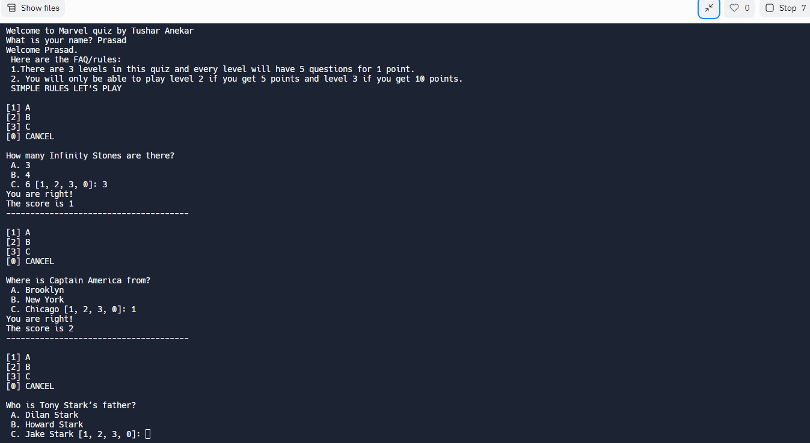

<h1>Marvel Quiz</h1>
A simple CLI app built with using REPLIT with the help of NodeJS language.

<h1>How does it work?</h1>
There are 3 levels and each level has 5 questions. User starts with level 1 and has to answer questions if gets all the answers correct then only user enters next level.

<h1>What is used in this application?</h1>
<ul>
    <li>Array</li>
    <li>Function</li>
    <li>Object</li>
    <li>Loop</li>
    <li>If Else</li>
</ul>

